Did you ever think what is blur exactly? Generally, the blur means something unclear or something that is hard to see. We can see blur (**as an effect**) everywhere: you can see the similar effect looking through frosted glass, or just looking on the street through a window in a raining day drinking coffee and feeling blue just for nothing. You can also see blur in so many applications and video games.


**Photo was provided by [Gabriel Santiago](https://unsplash.com/photos/l1sqXJXBgd0?utm_source=unsplash&utm_medium=referral&utm_content=creditShareLink).**

There are also a sub kind of blur that you even may not notice. This sub kind is called motion blur. You can, probably, see it in every video game, for example, in Crysis when you're moving camera.

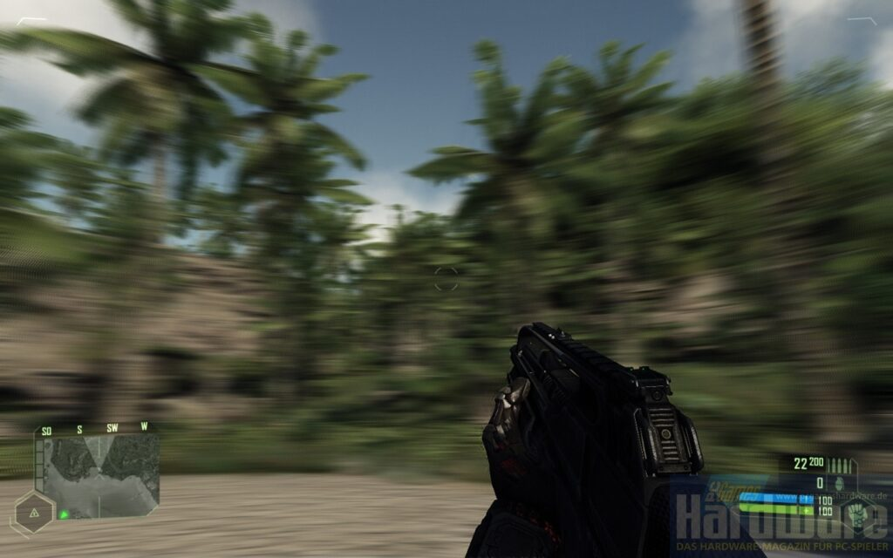

Although the definition is pretty accurate we gathered here together to listen something about algorithms, right? 😅 I wanna believe!

So, how can we achieve blur effect? Let's discuss the effect from the side of Android development. Obviously, you can use a default library. Luckily, in Android we have RenderScript that supports blur out of the box.

I am pretty sure that you can achieve the blur effect using [RenderScript](https://developer.android.com/guide/topics/renderscript/compute) in a few lines similar to the lines below:

```
val blur = ScriptIntrinsicBlur.create(rs, Element.U8\_4(rs))

blur.input = input
blur.radius = radius
blur.forEach(output)

output.copyTo(bitmap)
```

The end!


This approach is pretty simple, I want to believe that also is well tested, and of course is fast to implement. But RenderScript has its own price: it is an additional dependency and can result in increasing the application size and dex count, and more important it can be unavailable in some devices. Moreover, maybe it is not a really good idea to add a really huge library as RenderScript if you need to implement the blur only. And last but not least, **RenderScript is deprecated since Android 12**. Starting from Android 12 you can use [RenderEffect](https://developer.android.com/reference/android/graphics/RenderEffect) to achieve the same result.

Unfortunately, Android 12 is running on 26.6% of the devices (**_according to the data on January, 2022_**). So, approximately, we will see that in two next years Android 12 will be supported by the half of android devices and maybe in the next 5-6 years we will see that a lot of (**_\>50%_**) devices running Android 12 🤞 Sounds pretty optimistic, right? And it would be less fun if I will finished the article saying that you should proceed with the default approach!

Let's move to the topic. The classical blur algorithm can be implemented using a convolution approach. Convolution is a mathematical operation that combines to functions **f** and **g** and produces a new function, that shows how one of them is affecting the shape of the other. Yeah, I know that the definition is pretty boring and, kind of, useless for understanding.

The idea of blurring algorithms is to take each pixel of the original image I and mix this pixel with its neighbours where each neighbour has its own weight. Usually, the amount of neighbours is denoted as a radius of blur. It is pretty convenient to organise all these weights in a special matrix which is called kernel. You can see the example of such matrix below:

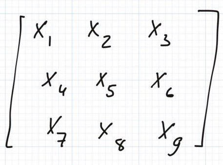

The radius of this matrix is **1**. The neighbours matrix can be any size you want and the bigger size of the matrix the bigger blur is pronounced. The primary idea of convolution is to take this matrix and calculate average of a weighted sum of every pixel in the original image. The result is the pixel of the final image.

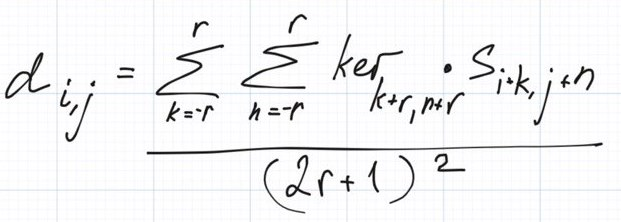

**d** is a destination image, **s** is a source image, **ker** is kernel (the matrix of neighbours we discussed before), and **r** is radius. We can imagine some pseudocode that calculates blur for the entire image. As we are talking about Android I will use [Bitmap](https://developer.android.com/reference/android/graphics/Bitmap) here and further.

```
int width = bitmap.width
int height = bitmap.height

for (int i = 0; i < width; i++) {
    for (int j = 0; j < height; j++) {
        bitmap.setPixel(i, j, convolution(i, j, bitmap, kernel)
    }
}

int convolution(int i, int j, int radius, Bitmap bitmap, float\[\]\[\] kernel) {
    long sum = 0;

    for (int k = -radius; k <= radius; k++) {
        for (int z = -radius; z <= radius; z++) {
            sum += bitmap.getPixelAt(i + k, j + k) + kernel\[k + radius\]\[z + radius\];
        }
    }

    return (int) (sum / Math.pow(2L \* radius + 1, 2));
}
```

_Note: for the sake of readability I skip handling out of bounds situations but you should always keep this check in your mind._

In this pseudocode we are iterating over every pixel of the source image and applying convolution during the iteration. You may wonder if this code is efficient enough to use it. The answer depends on where are you going to run it. If you are going to run it on your CPU then it definitely does not worth it but GPU can perform this computation pretty efficient cause the convolution method is a really good candidate for parallel computations. Anyway, let's estimate the complexity of the method in big-O notation:

* * *

| **Criterion** | **Estimation** |
| --- | --- |
| **Runtime** | O(w_h_r2) |
| **Memory** | O(1) |

**In this table: w is width of the image, h is height, and r is radius**

Before going further, let's discuss a kernel of the convolution. How should we assign weights to our neighbours? Usually, when somebody is talking about blur algorithms they mean [Gaussian blur](https://en.wikipedia.org/wiki/Gaussian_blur). Gaussian in this algorithm stands for the specific kernel type - **Gaussian kernel**.

The Gaussian kernel is defined by the gaussian function for 2 variables:

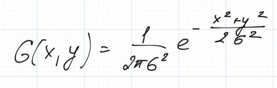

And the function looks like the picture below, containing the highest weights in the center of the kernel and the lowest one on the boundaries.

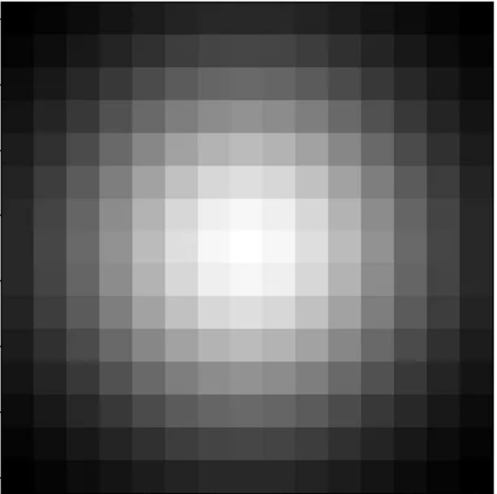

So, implementing Gaussian blur means to pre-calculate the kernel and then apply it for every pixel of the original image. The runtime complexity will be O(w_h_r2) which is quite expensive for software rendering. Moreover, we need additional O(r2) of memory to keep our pre-calculated kernel.

Luckily, we can replace this complicated kernel with something much simpler! For example, if we will replace this function with a constant our kernel would look like the kernel below:

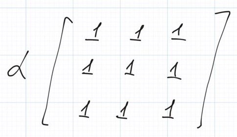

**alpha** in the matrix above is our constant. **alpha** can be any number but choosing huge numbers is can be pretty useless as it will result in turning the destination pixel into a white pixel as this factor will proportionally increase the final average value. So usually **alpha** is a number between 0 and 1. This algorithm is called ((https:\_\_en.wikipedia.org/wiki/Box\_blur Box blur)). Although it does not change the complexity of the algorithm it removes additional floating number arithmetic and reduces memory usage as we no longer need to keep the whole kernel. The runtime complexity still stays the same **O(w_h_r2)**.

To perform this calculation using CPU we need to reduce the complexity somehow. As now we are using **Box blur** we know that we can get rid of alpha and calculate it at the last step only instead of multiplying this factor with a neighbour every kernel step (because alpha is the same for every iteration)! What I am trying to say, imagine the sequence of numbers **a_b+a_c+a_d+…a_z** you can easily transform this sequence into something similar to this **a\*(b+c+d+…z)**, right? This means that the only thing that we need to calculate in our kernel computation is the sum of some rectangular area. Can we do it fast and efficient? It turned out that we can, hooray! We may the approach that is called **sliding window**.

Imagine that we have 1D array **a** and we need to say what is the sum of some continuous sub-array of this array **a**. Let's imagine that our array is like an array below:

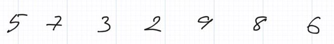

Then we need to introduce a window of some size, let's say 3 elements. A window is just a subset of elements, so window of size 3 contains 3 elements. The initial position of this window is trying to put the destination element in the center (let's say around 2nd element). You can see it in the picture below:

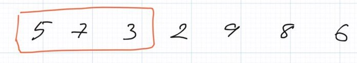

Then we need to calculate the sum of the elements of this window (**the sum is 15**), store the sum in another buffer array, and move the window one element to the right (to the 3rd element).

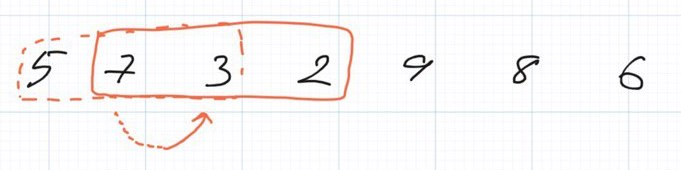

Can we reuse the previous sum instead of calculating the window all over again. Of course! You can see that the previous sum does not contain "new" element (we moved to that element) and contains additional "old" element (the very first element from the previous step). So in that case we need just add new element to the previous sum and remove an old element from the same sum.

**New sum will be 15 (previous sum) - 5 (the released element) + 2 (the new element) = 12. You can check by yourself that it is exactly the same sum as just adding together 7, 3, and 2.**

We should repeat the process until we traverse all elements of our array and calculate all sums of radius **r**.

The only unanswered question here is how to calculate sums for border elements. There are a lot of approaches there but I prefer to use the same window until we would be able to center the window around some point of the original array.

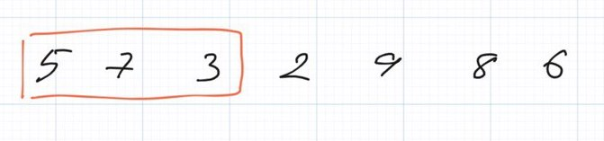

We can reuse the same window for the 1st and the 2nd element.

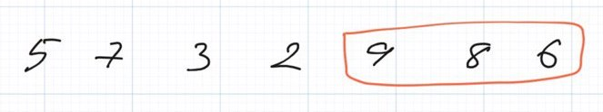

As well as we can reuse the same window for two last elements from the other side.

That is exactly what we need for our software blur. We need to query sum of some area pretty quickly, ideally, for **O(1)** then the final complexity will be **O(w\*h)** and that is exactly the same complexity as just iterate over the image. Fantastic!

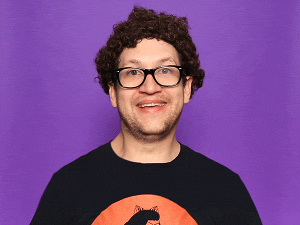

So if we will reuse this idea and will create a 2D array and will apply this window of some radius **r** (**this is our blur radius**) to every line then we will get an effect that is called horizontal motion blur.

You can imagine code similar to this:

```
        pixelsCopy = pixels.clone()

        for (row in 0 until height) {
            var a = 0.0
            var r = 0.0
            var g = 0.0
            var b = 0.0

            for (i in 0..2\*radius) {
                a += pixelsCopy.alphaAt(i, row, width, height)
                r += pixelsCopy.redAt(i, row, width, height)
                g += pixelsCopy.greenAt(i, row, width, height)
                b += pixelsCopy.blueAt(i, row, width, height)
            }

            for (column in 0 until width) {
                if (column < (width - radius)) {
                    a -= pixelsCopy.alphaAt(column - radius, row, width, height)
                    r -= pixelsCopy.redAt(column - radius, row, width, height)
                    g -= pixelsCopy.greenAt(column - radius, row, width, height)
                    b -= pixelsCopy.blueAt(column - radius, row, width, height)
                }

                if (column >= radius) {
                    a += pixelsCopy.alphaAt(column + radius, row, width, height)
                    r += pixelsCopy.redAt(column + radius, row, width, height)
                    g += pixelsCopy.greenAt(column + radius, row, width, height)
                    b += pixelsCopy.blueAt(column + radius, row, width, height)
                }

                pixels\[(row \* width) + column\] = Color.argb(
                    (a \* factor).toInt(),
                    (r \* factor).toInt(),
                    (g \* factor).toInt(),
                    (b \* factor).toInt()
                )
            }
        }
```

You can see the effect at the picture below. [The original image](https://unsplash.com/photos/Up2vc7w70ls) was taken from [my Unsplash account](https://unsplash.com/@st235).


If you will apply this effect vertically, pre-calculating the sums for every 1D column in the image, then you will get vertical motion blur!

And here the code again!

```
        var pixelsCopy = pixels.clone()

        for (column in 0 until width) {
            var a = 0.0
            var r = 0.0
            var g = 0.0
            var b = 0.0

            for (i in 0..2\*radius) {
                a += pixelsCopy.alphaAt(column, i, width, height)
                r += pixelsCopy.redAt(column, i, width, height)
                g += pixelsCopy.greenAt(column, i, width, height)
                b += pixelsCopy.blueAt(column, i, width, height)
            }

            for (row in 0 until height) {
                if (row < (height - radius)) {
                    a -= pixelsCopy.alphaAt(column, row - radius, width, height)
                    r -= pixelsCopy.redAt(column, row - radius, width, height)
                    g -= pixelsCopy.greenAt(column, row - radius, width, height)
                    b -= pixelsCopy.blueAt(column, row - radius, width, height)
                }

                if (row >= radius) {
                    a += pixelsCopy.alphaAt(column, row + radius, width, height)
                    r += pixelsCopy.redAt(column, row + radius, width, height)
                    g += pixelsCopy.greenAt(column, row + radius, width, height)
                    b += pixelsCopy.blueAt(column, row + radius, width, height)
                }

                pixels\[(row \* width) + column\] = Color.argb(
                    (a \* factor).toInt(),
                    (r \* factor).toInt(),
                    (g \* factor).toInt(),
                    (b \* factor).toInt()
                )
            }
        }
```

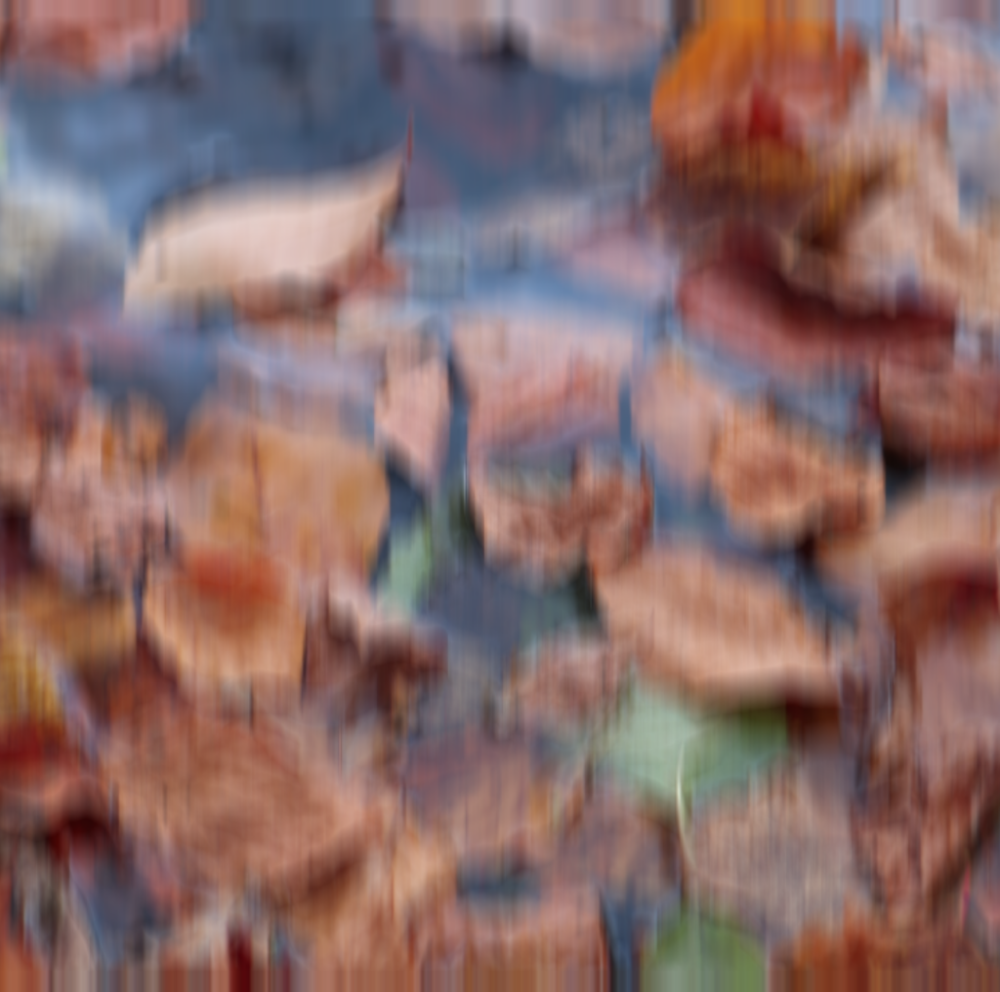

I really like the photos, but this is not the same effect that we were going to achieve in the beginning of the article. Indeed! To achieve the effect we need to calculate 2D area (the kernel) around some point. It is pretty easy to do, we need to calculate horizontal sums buffer and then calculate vertical sums for this horizontal sums buffer. Then we can calculate sums in 2D area around some point!

The final result is given at the picture below:


I did not attached the code listing to this article as the final listing is pretty huge and exactly implemented as descibled below. Nevertheless you can find the final code, wrapper for Picasso library (pretty famous Android image processing library, but some people prefer Glide 😱), and the usage example in [our repo](https://github.com/algoclub-xyz/Blur).

Hopefully, you enjoyed reading this article.

See you next time and may the force be with you!
