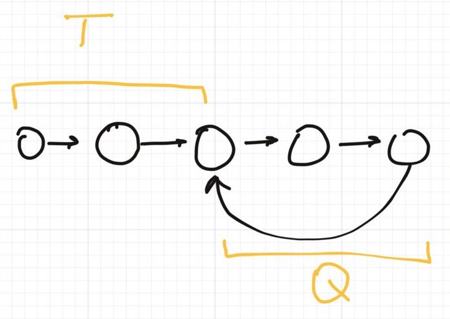
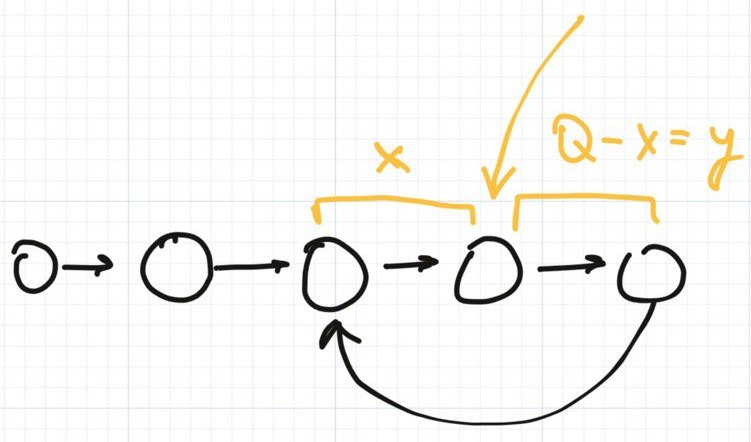
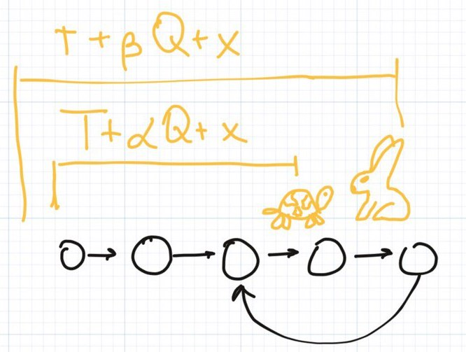

Pew-pew, subs!

How are you doing? Have you missed me?


Today we continue to observe tortoises and hairs from [the previous Solving Leetcode session.](https://algoclub.xyz/2022/01/30/solving-leetcode-141-linked-list-cycle/(opens in a new tab)) We're gonna solve the problem [#142 Linked List Cycle 2](https://leetcode.com/problems/linked-list-cycle-ii/).

> Given the `head` of a linked list, return _the node where the cycle begins. If there is no cycle, return_ `null`.
> 
> There is a cycle in a linked list if there is some node in the list that can be reached again by continuously following the `next` pointer. Internally, `pos` is used to denote the index of the node that tail's `next` pointer is connected to (**0-indexed**). It is `-1` if there is no cycle. **Note that** `pos` **is not passed as a parameter**.
> 
> **Do not modify** the linked list.

Like the last time let's start with the simplest and the most obvious approach. Let's store the list nodes in a _HashMap_ and iterate through over the list. If the current node exists on the map then we found a cycle and this point is the beginning of the cycle. If such element does not exist then return **null**.

```
    public ListNode detectCycle(ListNode head) {
        Set<ListNode> lookup = new HashSet<>();
        
        ListNode node = head;
        
        while (node != null) {
            if (lookup.contains(node)) {
                return node;
            }
            
            lookup.add(node);
            node = node.next;
        }
        
        return null;
    }
```

Let's estimate the complexity:

|  | **Complexity** |
| --- | --- |
| **Runtime** | O(n) |
| **Memory** | O(n) |

As you may notice this problem looks pretty similar to the previous one therefore also contains follow up. So, let's write it below:

> **Follow up:** Can you solve it using `O(1)` (i.e. constant) memory?

So, yeah, I won't bite around the bush, we can use the tortoise and hare approach once again to solve this problem, but we need to make one modification to it.

Let's recap the basic idea of the approach and some of the definitions. Let's denote the part of the linked list before the cycle as **_T_** (stands for tail) and the cycle as _**Q**_.



Then let's assume that tortoise and hare will meet at some point _(We already proved this idea at the previous article. They will surely meet if there is a cycle in the list.)_ and let's separate the cycle _Q_ **_by this point and the first point in the cycle_**.

The part between the starting point of the cycle and the meet point is denoted by **_x_**, and the other part of the cycle is **_y_** and _**y = Q - x**_ by definition.



When they both meet the tortoise will go **_T+aQ+x_** steps, where **_a_** is some factor, and the hare will go **_T+bQ+x_** steps, where **_b_** is also some factor. That seems correct.



Moreover, as the hare is move twice faster than the tortoise then **_T + bQ + x = 2 \* (T + aQ + x)_**. So,

**_T + bQ + x = 2T + 2aQ + 2x_**

**_T =_ (b-2a)Q - x**

Let's substitute **_b - 2a_** with some number, like, _**Z = b - 2a**_

**_T = ZQ - x_**

**_T = (Z-1)Q + Q - x_**

**_T = (Z-1)Q + (Q - x)_** and _**y = Q - x**_

**T = (Z-1)Q + y**

So, this means that if we place tortoise at the beginning of the list right after they both have met, and start the process again until they meet again, then after **_T_** iterations the tortoise will be at point _**\-T + T = 0**_ (the beginning of the cycle) and the hair will be at point **_(x + (Z-1)Q + y) mod C = ((x + y) + (Z-1)Q) mod C = (Q + (Z-1)Q) mod C = ZQ mod C = 0_**. Pay attention that we are moving the hare pointer now with the same speed as the tortoise (the speed is a one node by move).

So they will meet at the beginning of the cycle! Wow!!!


Now it's time to code the approach.

```
    public ListNode detectCycle(ListNode head) {
        ListNode slow = head;
        ListNode fast = head;
        
        while (fast != null) {
            slow = slow.next;
            fast = fast.next;
            if (fast != null) fast = fast.next;
            
            if (slow == fast) {
                break;
            }
        }
        
        if (fast == null) {
            return null;
        }
        
        slow = head;
        
        while (slow != fast) {
            slow = slow.next;
            fast = fast.next;
        }
        
        return slow;
    }
```

The complexity is:

|  | **Complexity** |
| --- | --- |
| **Runtime** | O(n) |
| **Memory** | O(1) |

Hooray! The follow up is achieved once again! That is all for today, folks. Thank you for reading the article and see you soon.
