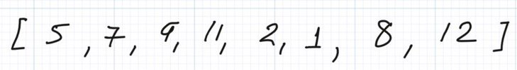
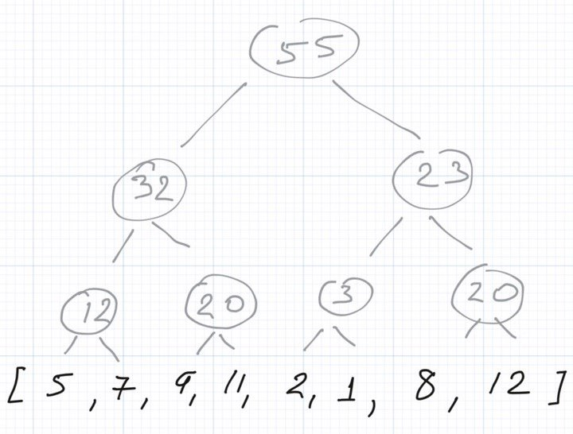
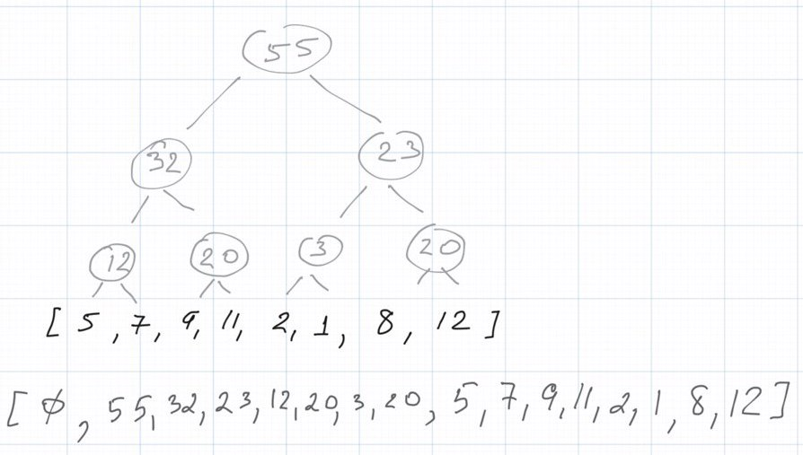
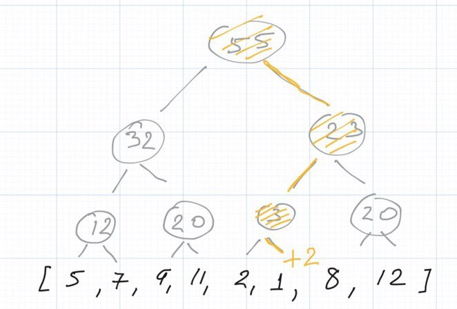

Hello folks 👋

Another week has come and passed. It means that it is time for another article, yay!

Do you remember the article about [Fenwick tree](https://algoclub.xyz/wp-admin/post.php?post=21&action=edit)? If don't then, please, revisit it before starting with this one.

During that article I mentioned an interesting data structure called Segment Tree. Unfortunately, I did not share any details about it.

> Note: also, there is another interesting data structure that can help us to achieve t_he same result. This data structure is called Segment Tree but this talk is out of the scope of the current article._
> 
> A fish called Fenwick tree

So, I am hurry to fix this issue. Let me talk about Segment Tree today.

Until we start to discuss the data structure I would like to introduce the problem. We have an array of integers and we want to perform 2 types of operations as fast as possible:

1. Update value at some index
2. Query sum on some interval **_\[start, finish\]_**

So it turned out that we can query some intervals for **_O(lg n)_** by representing them as a tree. And that is how Segment Tree works.

## Representation

Imagine we have an array like the array below:



We want to group elements in pairs and calculate the sum of those elements. That is how we create next level of elements within the tree. We want to repeat this operation until we have a level of only one element.

You can see the image of the tree for the given array:



How can we store this data structure?

Ideally, we can use an array! We need an array twice bigger than the original array, i.e. an array with the length of **_2n_** where _**n**_ is the length of the original one. Then we can place the tree level by level from left to right into this array. We will skip the first element of the array (_with index 0)_ and will consider this element as a dummy node.

Why did we place the tree in exact this way? This structure gives us a few useful tricks for every element in this array:

- for **ith** element the indexes of its two children are _**2i**_ and _**2i+1**_
- the parent of **ith** element is at the index _**floor(i / 2)**_

You example of representation is given below:



**∅** - dummy node

Wow! That looks pretty easy, doesn't it?


Let's move on and take a look on how we can update and query data to solve the problem from the beginning of the article.

## Operations

**_To update_** we need to update the element itself and all the nodes that contain this element in their sums. We already know that we grouped elements in pairs and parents consist of sums of children. Moreover, we constructed the tree that way the original elements are located at the last level of the segment tree. So they are leafs and we need to traverse all parents of our leaf.



Therefore, we need start from the leaf and go up until we meet the root. Leafs are located in the right half of the array that represents the tree, and we can calculate the parent of every node by dividing its index by 2.

The final code for this operation is quite straightforward:

```
    void add(int index, int diff) {
        int i = index + array.length;

        tree[i] += diff;

        for (int j = i / 2; j >= 1; j /= 2) {
            tree[j] = tree[2 * j] + tree[2 * j + 1];
        }
    }
```

**_Query_ operation** is a little bit more trickier. We need to keep track of left and right bounds of the interval and if we are currently on the edge of some interval we should exit this interval and add it to the sum. Sounds a bit confusing, right. Let me explain it.

- _For the left pointer the edge_ is every element with an odd index, as odd indexes are the ends of intervals.So we need to sum the value of the end of the interval and exit by increasing the left pointer.
- _For the right pointer_ the edge is every element with an even index, as even indexes are the beginnings of intervals.

After exiting the edges of the interval we should move one level up **_(to do that we need to move to the parents of both pointers by dividing their values by 2)_**. That is why if we will not exit those intervals we will go level upper and accidentally take extra elements in the resulting value.

This is the code for the proposed algorithm:

```
    int get(int from, int to) {
        int left = from + array.length;
        int right = to + array.length;

        int sum = 0;

        while (left <= right) {
            if (left % 2 == 1) {
                sum += tree[left];
                left++;
            }

            if (right % 2 == 0) {
                sum += tree[right];
                right--;
            }

            left /= 2;
            right /= 2;
        }

        return sum;
    }
```

Finally, let's estimate the complexity:

* * *

| **Method** | **Estimation** |
| --- | --- |
| **finding sum** | O(lg n) |
| **updating value by index** | O(lg n) |

Hooray! That is it folks. Traditionally, you can find the full implementation with t[ests at our repository](https://github.com/algoclub-xyz/Algorithms/blob/main/src/main/java/com/github/algoclub/trees/SegmentTree.java).

Good luck and see you soon!

_PS: You can try to solve the problems that we recommended in the article about Fenwick tree using Segment tree this time._


