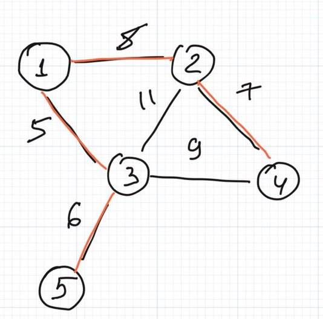
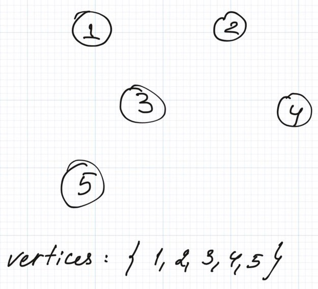
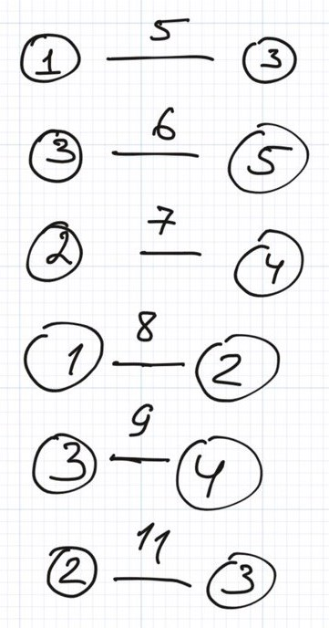
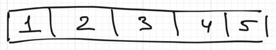

Hello folks 👋

Glad to see you reading this article again! Today we're gonna talk about problems in graphs.

Let's take a look at the problem below.

Imagine we have an edge-weighted undirected graph consisting of a few nodes. Our target is to find a _minimum spanning tree_ in this graph.

**_Minimum spanning tree_** is an undirected subgraph that contains all the vertices without cycles and with a minimum edges weight.

For example, for the graph below:


The spanning tree is given in red:



To build this tree we can use the following strategy:

1. Sort edges by weight
2. Pick an edge with a minimum value
3. If the edge does not lead to cycles we add it to the spanning tree, otherwise skip the edge and return to the **_step 2_**
4. Repeat until **_no edges left_**

This algorithm is called [Kruskal's algorithm](https://en.wikipedia.org/wiki/Kruskal%27s_algorithm).

The algorithm below looks pretty straightforward except one question. How to check if two vertices creates a cycle in a graph and do it fast.

We can utilise a wonderful data structure called _**Union Find.**_ As you may guess, the structure can help you to perform two operations: union and find.

Surprise, surprise 😱


Let's take a look at the graph above. We will start the algorithm with _5 different unconnected vertices and a set of sorted edges_.



Vertices

And here goes the sorted list of vertices:



Edges

Let's try to construct UnionFind. To implement this data structure we need to define a set of vertices and associated some sets. We can start by saying that every node belongs to the set of size 1 containing only that node. We can define this set by introducing a new array that will have a parent node identifying the unique node for every set.

In the begging, every set is identified by their only node (like on the picture below).

**_Warning: I am using 1-indexed array in the sake of convenience_**.



Let's take a look how UnionFind works step by step:

| **Step** | **Edge** | **Array** | **Note** |
| --- | --- | --- | --- |
| **0** | \- | \[1,2,3,4,5\] |  |
| **1** | 1 - 3, _weight_ 5 | \[1,2,**1**,4,5\] | We are trying to **_union_** nodes 1 and 3. To do that we need to **_find_** parents of these nodes.   Parent of node 1 is **1** and for node 3 is **3**. Parents are different so these nodes belong to different sets and we can **union** them. |
| **2** | 3 - 5, _weight_ 6 | \[1,2,1,4,**1**\] | Parent of node 3 is **1** and of node 5 is **5**. We can **union** them as the parents are different. |
| **3** | 2 - 4, _weight_ 7 | \[1,2,1,**2**,1\] | Parent of 2 is **2**,   and parent of 4 is **4**, let's **union** them too! |
| **4** | 1-2, _weight_ 8 | \[1,**1**,1,2,1\] | Parent of 2 is **2**,   and parent of 1 is _therefore we can perform_ **union** operation. |
| **5** | 3-4, _weight_ 9 |  | Parent of 3 is **1**,   and parent of 4 is **1**. You may wonder why the parent of node 4 is **1** but not **2**? That is happening cause the parent of 4 is **2**, then the parent of 2 is **1** and finally parent of 1 is **1**. We can stop our lookup when we found a node that has itself as a parent because that is the root (or unique identifier) of this set.   So these two nodes have the same parents that is why we **cannot** merge them! |
| **6** | 2-3, _weight_ 11 |  | Parent of 2 is **1** and parent of 3 is **1**.   We cannot merge these nodes as well. |

So the answer will be the next edges: 1 - 3, 3 - 5, 2 - 4, 1 - 2.

You, probably, already noticed that we performed two operations: find and union. Let's talk more about these operations.

## Find

While **_finding_** the parent of nodes we were doing the following operations:

1. We started from some node for which we are trying to find a parent
2. Using the array we were getting the parent of the current node (**we can use the code like this _array\[node\]_**)
3. If the parent equals to node then the **parent is found** and we can **stop** searching. Otherwise assign parent to the current node and return to step 2.

The very basic implementation can look like this:

```
int find(int node) {
    if (parents[node] == node) {
        return node;
    }

    return find(parents[node]);
}
```

Although the approach would work we can do it more efficient! It looks like we are doing a lot of unnecessary iterations if we are traversing the same path multiple times, for example, if we will call **find** **n** times for node 3 we will traverse all the way up to this node's parent **n** times. Why do we need do this?

Exactly, we don't! We can perform an optimisation that is called **_a path collapse optimisation_**. We can memorise already visited nodes and parents for them.

```
int find(int node) {
    if (parents[node] == node) {
        return node;
    }

    parents[node] = find(parents[node]);
    return parent[node];
}
```

## Union

During **union** we were trying to merge two sets together, right? Actually, we were just connecting one parent to another parent by replacing the parent reference. Look at the code below:

```
void union(int a, int b) {
    int parentA = find(a);
    int parentB = find(b);

    parents[parentA] = parentB;
}
```

This is also a pretty straightforward method.

As you can see we are linking parentA set and parentB set by linking two sets together. So this means that every path in the subset **a** has now been extended by paths from the subset **b**. This is fine if the size of **a** is smaller than the size of **b**.

Unfortunately, if the size of **a** is bigger than the size of **b** then we need to collapse more paths and the proposed approach will just increase **find** operation performance!

So let's always merge smaller sets into bigger ones. It will help to decrease the amount of needed collapse operations because the size of the set is smaller.

We can store an additional **sizes** array and keep track of subtree sizes. If **a** is bigger than **b** we can swap these sets. It will improve the performance of our method.

```
void union(int a, int b) {
    int parentA = find(a);
    int parentB = find(b);

    int sizeA = sizes[parentA];
    int sizeB = sizes[parentB];

    if (sizeA > sizeB) {
        int t = parentA;
        parentA = parentB;
        parentB = t;
    }

    parents[parentA] = parentB;
    sizes[parentB] = sizeA + sizeB;
}
```

Yay! We're all set and ready to solve Kruskal's problem. Hooray 🎉

Full implementation is, **traditionally**, available at [our Github repository](https://github.com/algoclub-xyz/Algorithms/blob/main/src/main/java/com/github/algoclub/graphs/UnionFind.java).

That's all for today folks.

Thank you for reading the article and see you next time!
