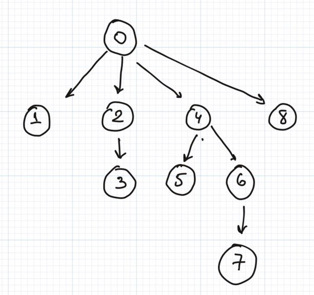
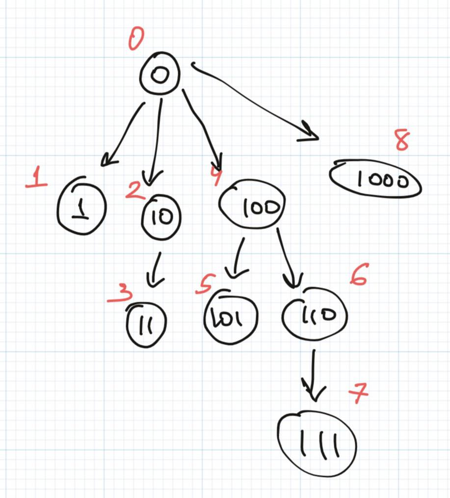
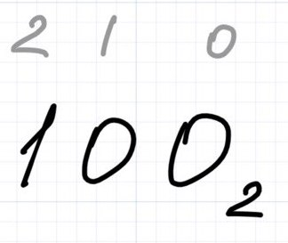
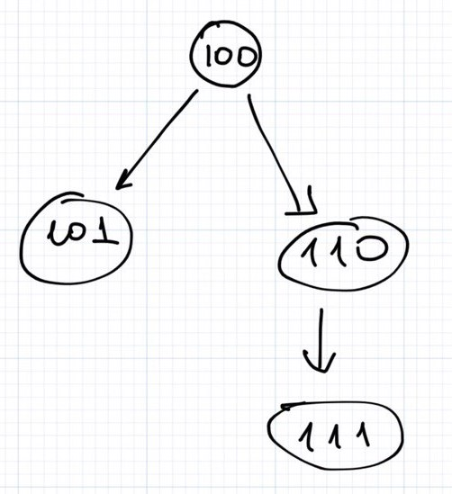
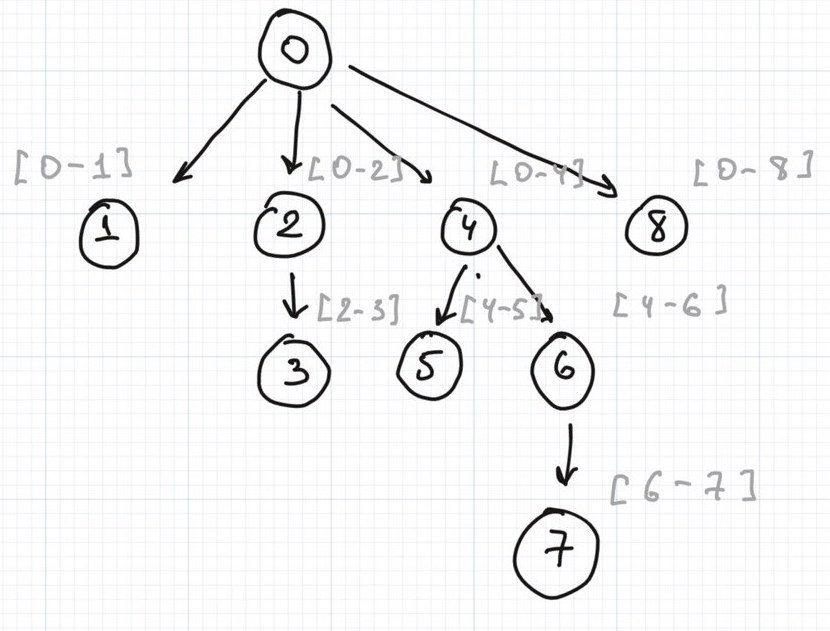
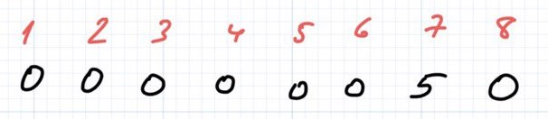
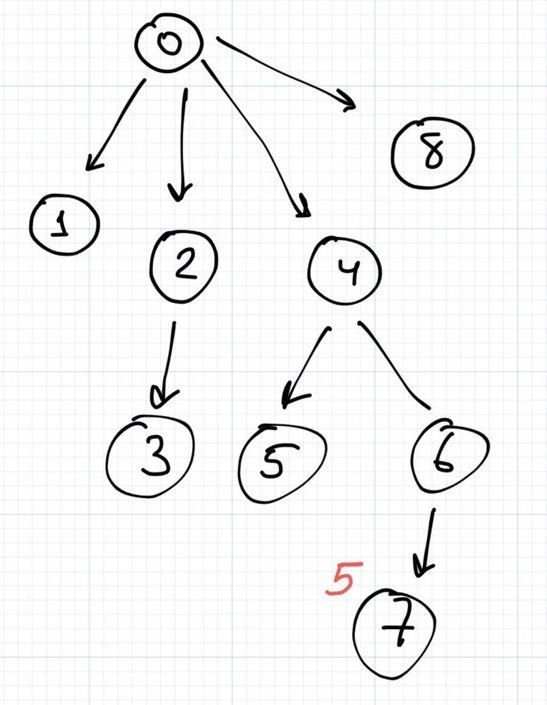
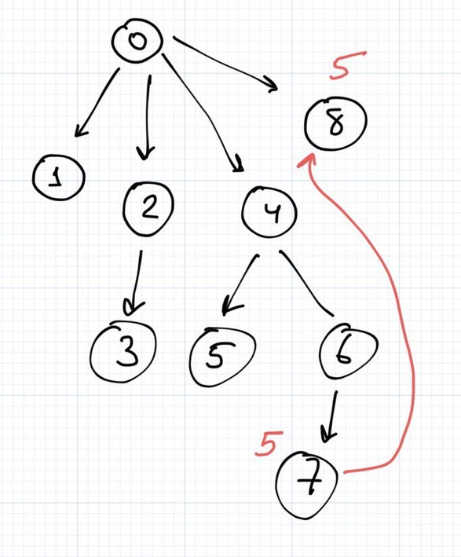
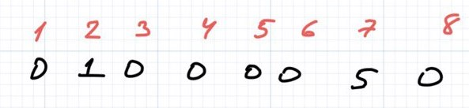
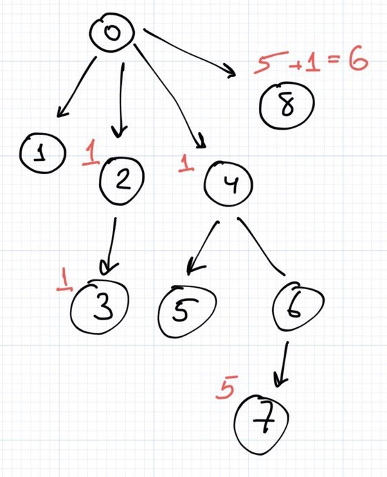

You may wonder, "Fenwick what? Which tree???". Don't be afraid of the spooky term the idea is pretty innocent. Remember: fear is the path to the dark side.

First of all, let's start with a simple problem:

> Imagine you have an array **a** of integers of length **n**. For the sake of simplicity let's assume it is a one-dimensional array.  
> You are given 2 values **start** and **finish** and your goal is to find a sum of all elements in this array between **start** and **finish**.

Let's declare a few formal constraints before nailing down the problem.

> n > 0  
> 0 <= start < n  
> 0 <= finish < n  
> start < finish

One may think that the problem can be solved by declaring a loop from **start** up to **finish**. And… Indeed, the solution can be found in the question.

```
    public static int findSum(int[] array, int start, int finish) {
        int sum = 0;
        for (int i = start; i < finish; i++) {
            sum += array[i];
        }
        return sum;
    }
```

Is our code efficient? I believe so, but we can also address this question in a more strict way - using _big-O_ notation. The method requires some amount of iterations that linearly depends on the size of the array, therefore the runtime complexity is linear. In terms of memory, we don't use any additional arrays or data structures and the program's memory consumption does not depend on the size of the input _(let's do not count the input in the memory estimation)_, so the memory consumption is constant. We can summarise this idea in the small table below.

* * *

| **Criterion** | **Estimation** |
| --- | --- |
| **Runtime** | O(n) |
| **Memory** | O(1) |

Let's bring more challenges and extend the problem statement.

salt.gif

What if now we need to update the values of the array independently and then query the sum. We can try to imagine the following data structure to organise our code:

```
class ArrayHelper {
    
    ArrayHelper(int[] array);

    /**
     * Returns the sum of the array
     * from start to finish,
     * both including.
     */
    int findSum(int start, int finish);

    /**
     * Updates the value at the given index
     * with a new value
     */
    void update(int index, int newValue);
    
}
```

Haha, now we faced a pretty dramatic reality. If we leave our algorithm "as is" it can be very inefficient. Hold on… let's discuss the problems step by step.

Can we imagine the update method? Of course, it can look like this:

```
void update(int index, int newValue) {
    this.array[index] = newValue;
}
```

So the **runtime complexity** for our helper class can be summarised in the following table:

* * *

| **Method** | **Estimation** |
| --- | --- |
| **finding sum** | O(n) |
| **updating value by index** | O(1) |

Is this implementation bad? **Not at all!** It can be pretty useful if you have a lot of update operations, much way bigger than looking for the sum on some interval.

Although the described approach can be useful in some situations we may need to do the opposite: now we know that we will frequently call the **findSum** method and super rarely ask the class to update the index. Is it possible to implement the class in a way that will better reflect our needs? If you're convinced that the answer to this question is positive then you're 100% right.

The main idea of the solution can be to pre-calculate the values somehow and then query them. We can solve the problem with help of **Dynamic Programming**. We can pre-calculate the sums of the array from left to right and then query the difference between the first and the last indexes.

_Note: I skipped a few boundaries checks for the sake of simplicity and readability but you should always keep in mind that you need to validate the data._

```
class ArrayHelper {

    private final int[] prefixSums;

    ArrayHelper(int[] array) {
        prefixSums = new int[array.length];

        prefixSums[0] = array[0];
        
        for (int i = 1; i < array.length; i++) {
            prefixSums[i] = prefixSums[i - 1] + array[i];
        }
    }
    
    int findSum(int start, int finish) {
        return prefixSums[finish] - prefixSums[start - 1];
    }
    
    void update(int index, int newValue) {
        int diff = newValue - prefixSums[index];
        for (int i = index; i < prefixSums.length; i++) {
            prefixSums[i] += diff;
        }
    }

}
```

So, as we can see the runtime complexity has changed. We can query the sum instantly but should spend a significant amount of time trying to update the value at some index. And again let's summarise the complexity of the given code:

* * *

| **Method** | **Estimation** |
| --- | --- |
| **finding sum** | O(1) |
| **updating value by index** | O(n) |

A curious mind can see that the approaches above cover pretty narrow use-cases. Indeed, they look more like tradeoffs. So you may wonder, "Is there any other approach that can give us better than linear complexity for both methods at the same time?"

And here we are! Finally, we made it through down to the **Fenwick Tree**. So this data structure should be able to help us to achieve **_O(ln n)_** for both methods! Let's take a look at how it works.

Note: also, there is another interesting data structure that can help us to achieve t_he same result. This data structure is called Segment Tree but this talk is out of the scope of the current article._

Fenwick Tree _(aka Binary Indexed Tree)_ is a data structure that can help us to build and maintain the prefix sums for some array of numbers. The data structure can be represented as a tree where each node represents the beginning or the ending of some interval and the path between any nodes represents the interval itself.

For example, let's imagine a tree with 9 nodes.



What can we see there? Usually, and this picture is not an exception, 0 is **a dummy node**. You can make it the root node in your representation. As descendants of the root node, you can see different nodes in some order. How did we arrange them?

To address this question we need to recall quickly the very basics of binary calculations and how the decimal numbers are represented in binary code.

Let's take a look at the simple examples:

* * *

| **Decimal** | **Binary** |
| --- | --- |
| 2 | 10 |
| 5 | 101 |
| 8 | 1000 |
| 10 | 1010 |
| 17 | 10001 |
| .. | .. |

Now let's replace the numbers with their binary representations.



Do you see what I see? Find the **rightmost 1 in the given number** _(reading from left to right)_ and all children will have **the same values** at positions to the left of the rightmost 1 _(including the rightmost 1 itself)_ and **any values** at positions to the right of this 1, except all zeros.

Let's take a look a bit closer at the subtree of **the node 4**.  
The rightmost 1 at the binary representation of 4 is at the 2nd position _(0 indexed)_



And all children of 4 should have exact the same values to the right of this rightmost 1 (including) and any numbers to the left: so infinite amount of 0 at positions \[+inf, 3\], then goes the rightmost 1 at the second position, and any numbers at the first and second positions.



So, more formally, if **100** is the binary representation of the number 4, then any children of this node should be **1XX**, where X is any **binary** number. Applying this rule recursively we can figure out the relationship between the nodes.

For example, the sequence of numbers from 0 to 8.

* * *

|  | **Mask** | **Children** |
| --- | --- | --- |
| 0 | Does not have any 1 (we can think that the rightmost 1 has the infinite position) so children can be anything | 1,2,3,4,5,6,7,8 |
| 1 | The rightmost 1 has position 0, so no place left for children | No children |
| 2 | **1**X | 3 |
| 3 | 1**1** | No children |
| 4 | **1**XX | 5(101), 6(110), 7(111) |
| 5 | 10**1** | No children |
| 6 | 1**1**X | 7(111) |
| 7 | 11**1** | No children |
| 8 | **1**XXX | 9(1001), 10(1010), 11(1011), 12(1100), 13(1101), 14(1110), 15(1111); but we don't have these numbers in our sequence |

**the node 4** is the parent for another 3 nodes: 5, 6, and 7. **5** has no children. **6** is the parent for **7**. **7** has no children. Therefore, **5** and **7** are leafs, **5** is connected to **4**, **7** is connected to **6** as it is the biggest parent and **6** is connected to **4**.

Easy, right? That is not at all. Can we find the parent for a node if we know this node. Let's take a look at the few numbers, for example, **7** and **5**. 7 (_in binary is 111_) was conducted from 6 _(in binary 110)_; 5 _(in binary 101)_ was conducted from 4 _(in binary 100)_. Do you see the consistent pattern? We can reverse what we did before to find children of the nodes (aka **find children** operation) if we find the rightmost 1 in the node and then replace this node with **0**.

* * *

| **Node** | **Binary** | **Parent** |
| --- | --- | --- |
| 7 | 11(**1→0**) | 6 |
| 5 | 10(**1→0**) | 4 |
| 10 | 10(**1→0**)0 | 8 |

Wow! Looks awesome and a bit magical.


Do you remember what I said when I introduced the Fenwick tree for the first time? Every node represents _the start or finish of some interval and the paths between nodes are intervals themselves_. Let's take a look at our tree once again. Can you determine the intervals?



Hopefully, for now it is more clear how to represent any interval using this data structure. As you've already noticed from the picture the intervals become more "narrow", like, \[0-4\]→\[4-6\]→\[6-7\].

So if we want to take the interval \[0-7\] we can take such nodes as 0→4→6→7, if we want to take interval \[0-8\] we can take 0→8, looks easy. Stop… but what if we wanna take an interval from \[3-6\]? We can take node 3, and 4→6, but it would be much easier to take interval \[0-6\] by taking 0→4→6 and subtract interval \[0-2\] as we already know how to find it: 0→2.

So now we know how to represent any interval using such tree, hooray! How can we store something in that tree? It is pretty easy, I promise. Let's imagine a simple array (indexes are in red):



So, obviously the interval \[1-7\] has prefix sum of 5 as long as intervals \[2-7\], \[3-7\], \[4-7\], \[5-7\], \[6-7\], \[7-7\] and \[7-8\].

Let's take a look at the intervals \[1-7\], \[2-7\] … \[7-7\]. All these intervals should return 5 as their prefix sum, but! intervals \[1-4\], \[1-1\], \[1-2\] and some others should still return 0. That is why we **cannot** store the value of the 7th element in the node different from the node 7. Other nodes will affect other intervals, like, the node 2 will affect at least the interval \[0-2\], the node 4 at least \[0-4\] and so on!

We should associate the value of the 7th element of the array with the node 7!



Let's check \[2-7\]. We will get this interval by subtracting \[0-1\] from \[0-7\].  
\[0-7\] consists of nodes 0, 4, 6, 7 and their sum is 0 + 0 + 0 + 5. 
\[0-1\] consists of nodes 0, 1 and their sum is 0 + 0 = 0

\[0-7\] - \[0-1\] = 5 - 0 = **5**. This looks right! Hooray!

Let's now check \[7-8\] interval by querying \[0-8\] and subtracting \[0-6\].  
\[0-8\] consists of nodes 0, 8 and their sum is 0. 
\[0-6\] consists of nodes 0, 4, 6 and their sum is also 0.

\[0-8\] - \[0-6\] = 0 - 0 = **0**. So, this is not right! Probably, we forgot about something. Let's think if we add some value in the array at the **n**\-th position then the prefix sum of all elements starting from the **n**\-th position until the end of the array should update. Indeed.

Where can we find the next elements? There are two candidates:

1. We can find the elements that are bigger than our node in our subtree. So the node 7, unfortunately, does not have any children so no need to update them.
2. To right side of our node. Should we update all of the elements to the right? No, because of the way we construct the intervals. We are combining small different intervals into a big one therefore we should update only the top first nodes on the right, because all other paths will have these very first nodes. In our case the next top-level node to the right will be the node 8. If we had the node 16 then we should have updated this node as well.



Let's double check \[7-8\].  
\[0-8\] consists of nodes 0, 8 and their sum is 0 + 5 = 5. 
\[0-6\] consists of nodes 0, 4, 6 and their sum is also 0 + 0 + 0 = 0.

\[0-8\] - \[0-6\] = 5 - 0 = **5**. Wow! That actually works 😅

Let's continue our exercise and add 1 to the **2nd** position in our array.



We need to update the node 2, its children (3), and all top nodes to the right (4, 8).



We can query a few values now.

\[0-4\] = 1 ✅  
\[3-4\] = \[0-4\] - \[0-2\] = 1 - 1 = 0 ✅  
\[0-8\] = 6 (now it consists of two values 1 at the 2nd position and 5 at the 7th position) ✅

One more question before we will start coding it. How to handle the remove operation from an array? What if we remove the value 5 from the 7th position in our array? The answer is pretty simple: **consider removing as adding the difference between the new state and the old one**. If our new array has 0 instead of 5 at the 7th position, then let's add **0 - 5 = -5** to the position 7.


Now everything seems working and clear!  
We can do the most fun part - the code!111!

The complete implementation is given below:

```
public class BinaryIndexedTree {

    private final int[] tree;

    public BinaryIndexedTree(int n) {
        this.tree = new int[n + 1];
    }

    public BinaryIndexedTree(int[] array) {
        this.tree = new int[array.length + 1];

        for (int i = 0; i < array.length; i++) {
            update(i, array[i]);
        }
    }

    public void update(int index, int diff) {
        int current = index + 1;

        while (isValid(current)) {
            tree[current] = tree[index] + diff;
            current = sibling(current);
        }
    }

    private int parent(int index) {
        return index - theRightmostOne(index);
    }

    private int sibling(int index) {
        return index + theRightmostOne(index);
    }

    private boolean isValid(int index) {
        // 0 - is a dummy node
        return index > 0 && index < tree.length;
    }

    private int theRightmostOne(int index) {
        return (~index + 1) & index;
    }

}
```

I will discuss a few interesting places in the code that can be hard to understand.

```
private int theRightmostOne(int index) {
    return (~index + 1) & index;
}
```

This method extracts the rightmost 1 from the binary representation of an index.  
**7** in binary is **111**. So **~7** will be **000**, and **~7 + 1** will be **001**, and **(~7 + 1) & 7** is **001 & 111** which is exactly **001**.  
Try to do the exercise by yourself, for 5 for example.

```
private int parent(int index) {
   return index - theRightmostOne(index);
}
```

This method gives the parent by the node. Exactly like we discussed, we need to find the rightmost 1 in the node and replace it with 0.

```
private int sibling(int index) {
    return index + theRightmostOne(index);
}
```

Sibling is not quite correct term for this method, but I still like it. This methods gives us the next bigger element: children and the top level of the elements to the right.

```
this.tree = new int[array.length + 1];
```

Why we use **array.length + 1** here? Because 0 is a dummy node as array is 1-indexed by default. Don't forget it!

```
public void update(int index, int diff)
```

Also take a look at the line above, please. We are updating the array by the difference between the new state and the previous one.

**What to do next? Where to apply my sacred knowledge?**

You can try mastering your Fenwick tree at Leetcode (not an ad, hopefully, will be someday!)

- [https://leetcode.com/problems/range-sum-query-mutable/](https://leetcode.com/problems/range-sum-query-mutable/)
- [https://leetcode.com/problems/range-sum-query-2d-mutable/](https://leetcode.com/problems/range-sum-query-2d-mutable/)
- [https://leetcode.com/problems/count-of-smaller-numbers-after-self/](https://leetcode.com/problems/count-of-smaller-numbers-after-self/)
- [https://leetcode.com/problems/count-of-range-sum/](https://leetcode.com/problems/count-of-range-sum/)
- [https://leetcode.com/problems/reverse-pairs/](https://leetcode.com/problems/reverse-pairs/)
- [https://leetcode.com/problems/number-of-longest-increasing-subsequence/](https://leetcode.com/problems/number-of-longest-increasing-subsequence/)
- [https://leetcode.com/problems/queries-on-a-permutation-with-key/](https://leetcode.com/problems/queries-on-a-permutation-with-key/)
- [https://leetcode.com/problems/minimum-possible-integer-after-at-most-k-adjacent-swaps-on-digits/](https://leetcode.com/problems/minimum-possible-integer-after-at-most-k-adjacent-swaps-on-digits/)
- [https://leetcode.com/problems/create-sorted-array-through-instructions/](https://leetcode.com/problems/create-sorted-array-through-instructions/)

Thank you for all who finished reading the article!  
Pass on what you have learned and may the force be with you!
