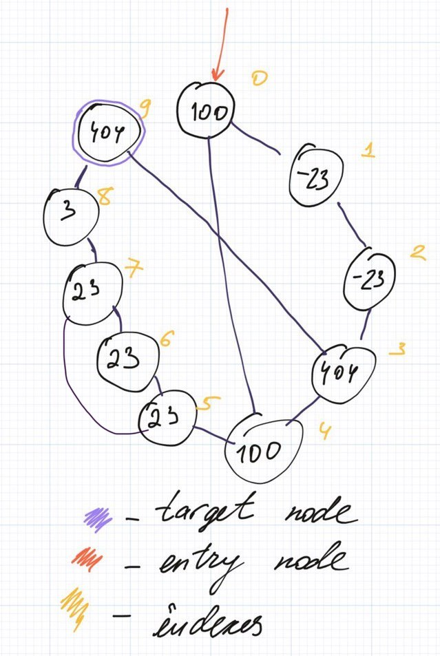
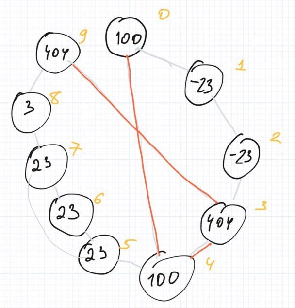
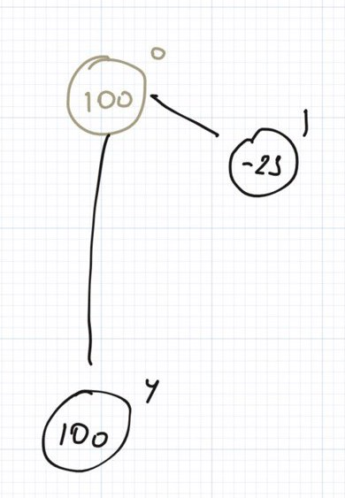
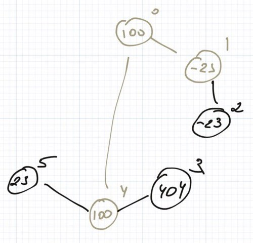
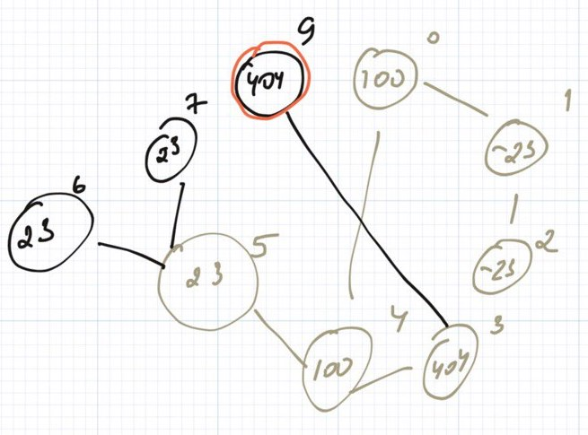

Have you missed me?


Yeah, me too and I am happy to be back again with a new article! Lately I did a thing and pretty glad to introduce a new have non-periodical column at our website! During these small sessions we are going to solve and explain the problems from Leetcode. Sounds exciting, right?

So this time the problem is [#1345. Jump Game IV](https://leetcode.com/problems/jump-game-iv). Let me also to copy the problem statement here.

> Given an array of integers arr, you are initially positioned at the first index of the array.  
> In one step you can jump from index i to index:  
> i + 1 where: i + 1 < arr.length. i - 1 where: i - 1 >= 0. 
> j where: arr\[i\] == arr\[j\] and i != j.  
> Return the minimum number of steps to reach the last index of the array.  
> //Notice that you can not jump outside of the array at any time.//

Hmm, the problem sounds pretty interesting and more important solvable! Before going further let's take a look at the given examples.

> \[100,-23,-23,404,100,23,23,23,3,404\]

The shortest path has length **3** and jumps on following indexes: **0 --> 4 --> 3 --> 9**.

The problem looks like a pretty typical graph problem. Every node is connected with at least 1 adjacent node (_i+1_ or _i-1_) and zero or more nodes that have exactly the same value. We can represent the array from example in the following manner:



So we should find the path that will connect the first and the target nodes together and will contain the least possible amount of edges. Let me highlight the path that will be the answer for this problem:



How can we find this path? You may already know that the algorithm that helps to find the shortest path (//in a weightless graph//) is BFS (//aka breadth-first search//). This algorithm allows you to scan the graph "level-by-level" starting from some node. By level I mean the distance (//btw, you can also count the distance as amount of edges between the nodes//) between the starting node and some other node. For example, related to the starting node:

- **0th level** is the starting node itself, because the distance between some node and itself is always 0
- **1st level** is the level that contains all the edges that connected with the starting node by exactly **one edge**
- **2nd level** is the level that contains all the edges that connected with the starting node by exactly **two edges**  
    …
- **n-th level** is the level that contains all the edges that connected with the starting node by exactly **n edges**

Let me explain the main principles of the algorithm on the given example.

1. We need to create an empty queue and place the very first node there


2. We need to remove nodes step by step from the queue and put all nodes that connected to the removed node.



This is the second iteration and the first level of nodes.



Third iteration and the second level.

3. We should repeat step 2 until we see the target node.



Haha, that was pretty **breezy**!


So going back to the original problem, how can we solve it?

1. We need to establish all the connections between nodes. As we also need to connect nodes with the same values we can pre-calculate all indexes for nodes with the same value using **HashMap**.
2. Having all the connections established, we can run BFS from the starting node until we will find the target node.
3. If target node is found we can return the **level** from BFS as the final answer.

And lastly let's also try to estimate the complexity:

* * *

|**Criterion**|**Estimation**|**Notes**|  
|**Runtime**|O(n)|We will visit each node twice: once during building the lookup table with indexes and one more time during the BFS.|

| **Criterion** | **Estimation** | **Notes** |
| --- | --- | --- |
| **Runtime** | O(n) | We will visit each node twice: once during building the lookup table with indexes and one more time during the BFS. |
| **Memory** | O(n) | We need to store indexes lookup and visited nodes for BFS. |

That is it!

_PS: **Don't like to read a tons of text?** We prepared a Youtube video clip with the explanation of the problem!_  
_PPS: the code is available at the end of this article._

https://youtu.be/1Dz1EbtDv-g

```
class Solution {
    public int minJumps(int[] arr) {
        Map<Integer, List<Integer>> lookup = new HashMap<>();
        
        for (int i = 0; i < arr.length; i++) {
            int element = arr[i];
            
            if (!lookup.containsKey(element)) {
                lookup.put(element, new ArrayList<>());
            }
            
            lookup.get(element).add(i);
        }
        
        Queue<Integer> queue = new LinkedList<>();
        Set<Integer> visited = new HashSet<>();
        
        queue.add(0);
        visited.add(0);
        
        int level = 0;
        
        while (!queue.isEmpty()) {
            int size = queue.size();
            
            for (int k = 0; k < size; k++) {
                int current = queue.remove();
                
                if (current == arr.length - 1) {
                    return level;
                }
                
                int next = current + 1;
                
                if (!visited.contains(next) && next < arr.length) {
                    visited.add(next);
                    queue.add(next);
                }
                
                int previous = current - 1;
                
                if (!visited.contains(previous) && previous >= 0) {
                    visited.add(previous);
                    queue.add(previous);
                }
                
                List<Integer> bucket = lookup.getOrDefault(arr[current], Collections.emptyList());
                
                for (int adj: bucket) {
                    if (!visited.contains(adj)) {
                        visited.add(adj);
                        queue.add(adj);
                    }
                }
                
                lookup.remove(arr[current]);
            }
            
            level += 1;
        }
        
        // impossible
        return -1;
    }
}
```
