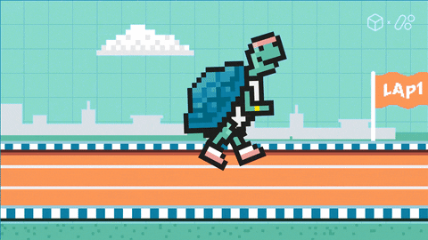
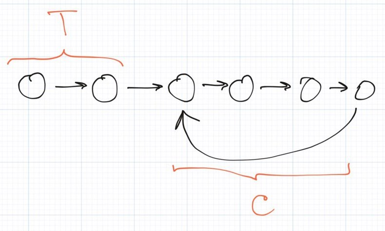
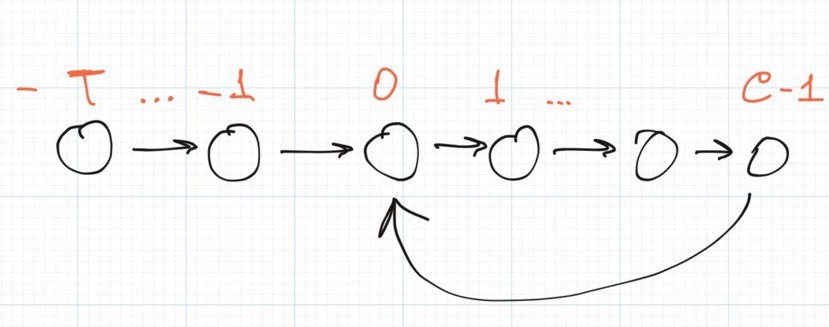
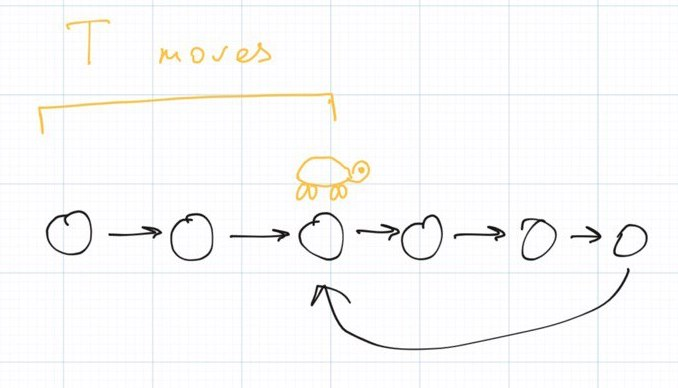
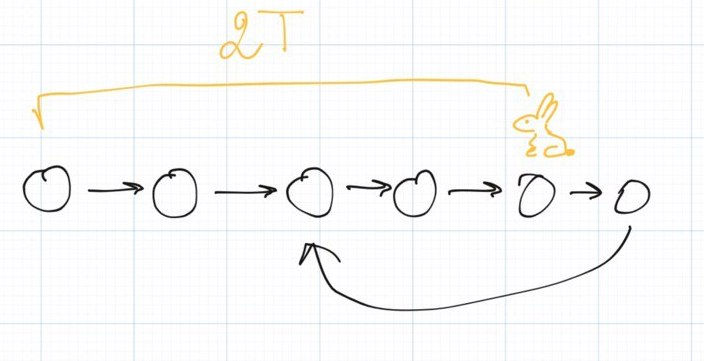
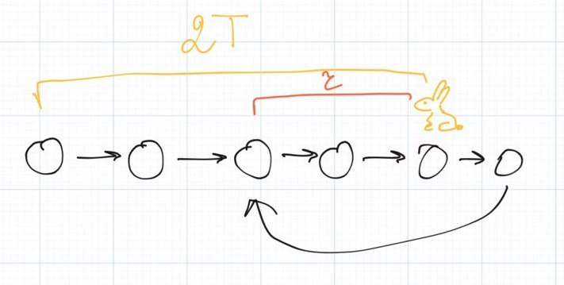

Yo-yo

Wow, another week has passed since the previous [Solving Leetcode #1345](https://algoclub.xyz/?go=all/solving-leetcode-1345-jump-game-iv/) article.

Today we are going to solve [#141 Linked List Cycle](https://leetcode.com/problems/linked-list-cycle/ problem). Let's start from the statement:

> Given head, the head of a linked list, determine if the linked list has a cycle in it.  
> There is a cycle in a linked list if there is some node in the list that can be reached again by continuously following the next pointer. Internally, pos is used to denote the index of the node that tail's next pointer is connected to. Note that pos is not passed as a parameter.  
> Return true if there is a cycle in the linked list. Otherwise, return false.

You may wonder, "Hey, it is a pretty simple problem: just store nodes in a hash set and compare the element with everything that you already have in this set". I have nothing to add here, we can, for real, solve the problem in that way:

```
    public boolean hasCycle(ListNode head) {
        Set<ListNode> lookup = new HashSet<>();
        
        ListNode node = head;
        
        while (node != null) {
            if (lookup.contains(node)) {
                return true;
            }
            
            lookup.add(node);
            node = node.next;
        }
        
        return false;
    }
```

Let's estimate the complexity of this approach:

* * *

| **Criterion** | **Estimation** | **Note** |
| --- | --- | --- |
| **Runtime** | O(n) | We need to iterate through over the list, so the runtime complexity **linearly** depends on the input size |
| **Memory** | O(n) | We need to store all visited elements therefore the memory complexity is also **linear** |

This approach is pretty actionable but not quite interesting, right? Let's scroll down and right below examples you will see the follow up:

> Follow up: Can you solve it using O(1) (i.e. constant) memory?

And this follow up makes the problem a little bit more challengeable, hooray!

In this article I will explain a quite interesting method that is called _tortoise and hare_.



Imagine, that we have two pointers and initially this pointers are pointing to the head of your linked list. Let's call them **the slow** pointer (this is our _tortoise_) and **the fast one** (this is our _hare_). The **fast** pointer is twice faster (tautology detected 🤯🤯🤯🤯) than the **slow** pointer.

So when **the slow one** is moving to the **next** element, **fast** moves to the **next's next** element.

- If the **fast** pointer reached the end of the giving list then we can safely assume that the list does not have a cycle
- If the **fast** pointer met the **slow** pointer then we can say for sure that the list has a cycle! You may wonder why?

Let me try to explain the main idea. Take a look at the linked list below:



Let's call the part before the cycle as **T** (this stands for tail) and the length of the cycle **C**. Then let's index the nodes of the list starting from the first node in the cycle. So the first node if the cycle is _0_, then goes _1_ and ends with the node **C-1**, before the cycle there will be nodes from **\-1** down to **\-T**.



So, let's move the **slow pointer/tortoise** to the first node of the cycle (_index 0_). It made exact **T** moves to reach there.



If tortoise made T jumps then **hare** made **2T** jumps,



ooooor, **2T (mod C)** jumps, or **r = (2T - T) mod C** jumps if we are counting jumps within the cycle.



Let's then move our tortoise for another **C-r** moves. Then the tortoise will be at index **0 + C - r = C - r**. The hare will do **2\*(C-r)** moves, so it will be at the position _**(r + 2(C - r)) mod C = (r + 2C - 2r) mod C = (2C - r) mod C = C - r**_. So as far as we can see the tortoise is at the index **_C-_r** and the hare is currently at the same index **C-r**. Hooray, the idea has been proved and they really met at some point in the cycle!

Let's now code this idea:

```
    public boolean hasCycle(ListNode head) {        
        ListNode slow = head;
        ListNode fast = head;
        
        while (fast != null && fast.next != null) {            
            slow = slow.next;
            fast = fast.next.next;
            
            if (slow == fast) {
                return true;
            }
        }
        
        return false;
    }
```

Let's estimate the complexity of this approach:

| **Criterion** | **Estimation** | **Note** |
| --- | --- | --- |
| **Runtime** | O(n) | We still need to iterate through over the list |
| **Memory** | O(1) | We need to keep only two pointers and nothing more! |

* * *

Hoooray, looks like we solved the problem with a followup 🎉


Hopefully, you enjoyed the article! See you next week!
