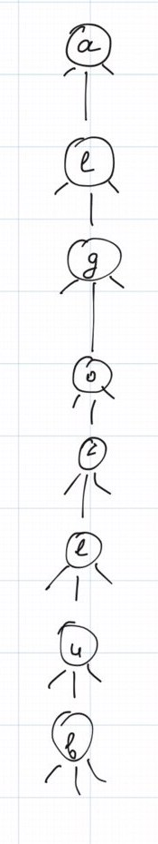
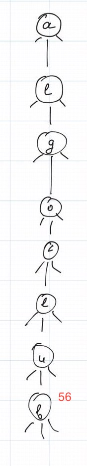
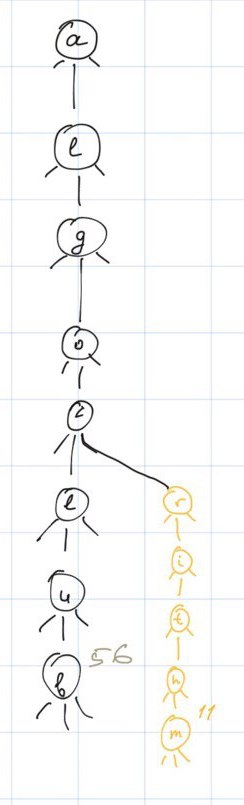
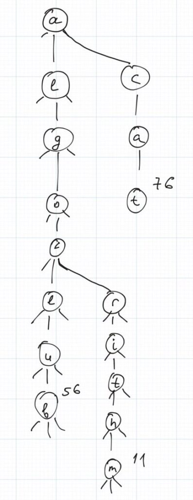

Wow! It's been another week from the time when I wrote the previous article about grokking algorithms. The time is passing so fast I barely can see it!

Today I want to introduce a new concept to you - **Ternary Search Tree** _(aka TST)_. You may already have heard about Binary Search Tree _(aka BST)_ and this idea is pretty similar. Don't worry if you did not hear about **BST** or any trees at all before, **TST** is pretty easy to understand and you will quickly nail it!

So, let's start with the basic definition, the Ternary Search tree is a search tree where every node has at most 3 children: left, middle, and right ones. The left child contains keys that are smaller than the parent's key, the middle one contains keys that are equal to the parent's key, and the right sub node contains keys that bigger. Besides the children, nodes also have a key and a value.

A node can be described using the pseudocode below:

```
// K is the key's type and V is the value's type
struct Node<K, V> {
    K key;
    V value;

    // references to the children, can be null
    Node left;
    Node middle;
    Node right;
}
```

Usually, the tree is used to store string keys because, unlike **BST**, **TST** distributes the string among the nodes.  
For example, to store the key "algorithm" it will use 9 nodes 😱

_PS: TST allows to store strings as keys more efficiently, in terms of memory, than Tries, and keeps nearly the same runtime performance. Moreover, Ternary Search Tree is pretty easy to implement!_

Let's image that we have a few key-value pairs: "algoclub" to 56, "algorithm" to 11, and "cat" to 76. Starting from the first pair let's try to put them into the tree and see the rules that are used to construct it.

First of all, let's make two things clear:

1. Although the string is used as a key we will be operate with the characters of this string
2. One character is bigger than another if and only if it goes after it in the alphabet. That is called [lexicographic order](https://en.wikipedia.org/wiki/Lexicographic_order).

**"algoclub" to 56**

That is the easiest possible case, let's take a look at the tree below:



As long as our tree is empty we can just put the whole string in the tree always making every character a node and linking them using the middle path. The next step is to associate the value with the last node in this tree, like on the image below:



Nothing hard so far! Let's see what will happen with the tree if we will try to add the next pair: **"algorithm" to 11**



We continue to move along the middle path as long as the characters between the node and the string are the same. The very first different characters are the characters at index 4 (_let's assume that the string and the tree are both 0 indexed_): **c** in "algoclub" and **r** in "algorithm". As long as we reached those characters we cannot proceed further using the middle path and should decide where to go: left or right. Do you remember the very beginning of this article: we go left when the next key is smaller than ours and to the right if bigger. So that is why we chose the right path and placed a node there. Then we can add all characters that left in the string to the middle path of that node.

Let's now insert the pair **"cat" to 76** . The very first characters between the tree and the string are different. However, we can still use the same strategy of comparing nodes and proceed with the right path _(**c** > **a** - going right again!)_. Then we need to repeat the process and just put everything that has left to the node's middle path as soon as we reached the empty node.


So using this logic we can summarise the algorithm for **adding elements** into the tree:

1. If the node for the associated character does not exist then we should create it and join everything that goes after the character as the middle child of the previous node.
2. If the node for the given character exists then we need to compare the key of the node and this character. If they are equal then we need to create a new node and append it to the middle, if our character is bigger then put a new node to the right, and left otherwise. Move to the next character in the string.
3. Repeat the process (steps 1 and 2) until we reach the end of the string.
4. Finally, associate the given value with the last node.

Wow, that looks pretty easy! Exactly like I promised!

Let's now take a look at the search operation. The logic is pretty much the same - we have a key (this term is pretty confusing but in this context the key is a string because this is a tree element's key but not the node) and we are trying to find an associated value. The process is quite similar and starts from splitting the key into characters then goes:

1. If the node for the given character is null then return null. Element was not found and we can stop the operation.
2. If the current node is not null, then we need to compare the node's key and the current character's key. If they are equal we should move to to the middle, if the character is smaller than the value then select left, and right otherwise.

Let's take a look at a few examples. The tree is still the same.



Let's find values using the next keys:

* * *

| **Key** | **Result** | **Comment** |
| --- | --- | --- |
| cat | 76 | **c** is bigger than **a**, then going right; **c** equals to **c** going middle and changing the key index; **a** from the key equals to **a** from the tree therefore going next; **t** is equals to **t** from the tree and this is the last character in the key; return the value of the current node - 76 |
| algb | null | **alg** proceeding using the middle path; the node **o** is not equal to the character **b** _(b < o)_, going left; left subtree is empty |
| algo | null | **algo** proceeding using the middle path; we stop at the node **o** and it has no value |

So that is pretty much it. We finally learned how to implement Ternary Search Tree. Good job!


Enjoy the rest of the week and see you soon!
