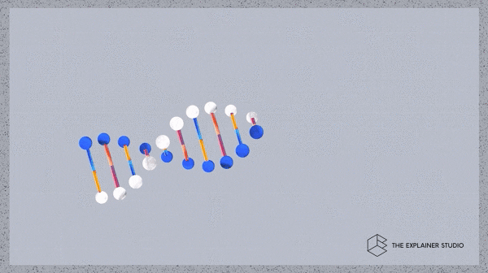
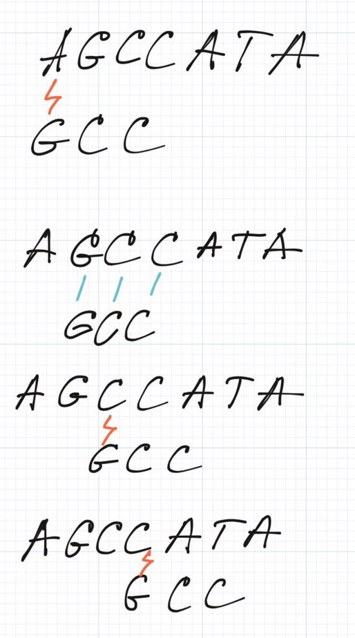

Hey folks 👋

I know it has been a long time since we've published the last article. We are really sorry for this delay! Let us do not beat around the bush and jump straight to the discussion topic: pattern matching.

_Have you ever caught yourself wondering,_ _"I have some text and I want to find a string in it. How can I do it?**"**_

Luckily, I have an answer for this question. However, everything has its time and I want to make you familiar with the problem itself firstly 🧐

### Motivation

_Let's take a look at the following problem:_ imagine we have some DNA sequence and we want to find another DNA subsequence in it. It is a really important problem for scientists who are looking for consistent patterns in animals and human genomes.

Let's take a closer look on a DNA sequence.

**DNA** stands for deoxyribonucleic acid and carries genetic information. DNA consists of 4 bases: Adenine (_aka "A"_), Thymine (_aka "T"_), Guanine (_aka "G"_), Cytosine (_aka "C"_).

  


  
The following example shows a DNA subsequence: "_ACGGTGTCGTGCTATGCTGATGCTGACTTATATGCTA_".

Besides, ordinary DNA sequences are much much longer than the example above. In particular, human genome takes about [750 megabytes of data; base pairs are coded using 2 bits](https://en.wikipedia.org/wiki/Human_genome#Information_content).

  
Therefore people who're analysing DNA subsequences need efficient pattern matching algorithms.

Let's also define a few terms that we will use further in this article:

- _**origin**_ is text or a string where we need to perform searching/matching;
- **pattern** is an object (usually a piece of text or a substring of some string) that needs to be found.

Like a small brainteaser I am offering you to find "_CGG_" **pattern** in "_ACGGTGTCGTGCTATGCTGATGCTGACTTATATGCTA_" **origin**. Stop reading the article here for a few minutes and try to find it analysing the algorithm that you were using during the process.

> Looks like the origin contains only one entry of the pattern, _"A**CGG**TGTCGTGCTATGCTGATGCTGACTTATATGCTA_".
> 
> How can we know it for sure?

### Simple Approach

The most basic and simple algorithm can be implemented in this way:

1. Create a pointer **_p_** and initialise it with the first index of the _**origin**_;
2. Check if a substring of the origin that starts at **_p_** and has exact the same length as _**pattern**_ equals to the _**pattern**_;
3. Move _**p**_ to the next position;
4. Continue to do that until you reach the end of **_the origin_**.

```
    void findPattern(String origin, String pattern) {
        int p = 0;

        while (p <= origin.length() - pattern.length()) {
            boolean patternFound = true;
            
            for (int i = 0; i < pattern.length(); i++) {
                if (origin.charAt(p + i) != pattern.charAt(i)) {
                    patternFound = false;
                    break;
                }
            }
            
            if (patternFound) {
                // pattern found
                // your code goes here
            }

            p++;
        }
    }
```

Generally speaking, we can imagine that the pattern is a sliding window over the origin. You can see the demonstration below:



Pattern is sliding over the origin

Nevertheless, the process itself is pretty straightforward and simple. The complexity analysis is not hard at all also:

* * *

| **Criterion** | **Estimation** |
| --- | --- |
| **Runtime** | O(m \* n), where **_m_** is the length of origin and _**n**_ is the length of pattern |
| **Memory** | O(1) |

Wow! It actually easy and very human-readable, nevertheless, we can try to improve the complexity of this method as it is still pretty slow 🐌

### Rabin-Karp

Can we do it better? Can we perform some pre-calculation on text to save some time? Were you thinking about it either reading the text above?

Indeed, these are really interesting question. Let's take a look at Rabin-Karp algorithm.

_A small disclaimer: Rabin-Karp is a heuristic algorithm and still has **O(m \* n) runtime complexity** in the worst case but it was proved that it works much better on average. Moreover, the algorithm is quite simple and much easier to understand than algorithms that provide better runtime complexity in all cases._

Imagine a string that consists of only decimal character. What do we know about it?

- First of all, we know that the alphabet of the string consists of 10 unique symbols;

- Secondly, we can consider every string as a number. This number distinctly identifies every string from infinite set of all strings that we can compose from a decimal digits alphabet. We can convert the string to a number using the following rule: we need to multiply characters' code (every character has a unique code in computer) on the size of the alphabet (for us it is 10 symbols for a decimal digits alphabet) in power **_i_**, where _**i**_ is the distance from the position of the character in the string until the end of this string.

Looks at the example below and it will make it much clearer:

> **_"54678" = 5 \* 104 + 4 \* 103 + 6 \* 102 + 7 \* 101 + 8 \* 100 = (((5 \* 10 + 4) \* 10 + 6) \* 10 + 7) \* 10 + 8 = 54678_**
> 
> Example

Can we reuse this information? So, if I ask this question then I have a positive answer, right? 😅

Let's revisit this example one more time: the pattern is "**_56432_**" and the origin is "4351**_56432_**678". I highlighted the pattern within the origin for your convenience. What do we know about the pattern? The pattern can be represented as a decimal number that will be a unique identifier for it and this identifier for the pattern is **56432**.

Along this we also know that primitive types and classes (integer or/and long, for example) that can hold integer numbers are pretty efficient and can perform basic integer operations like comparison for O(1). This is much faster than comparing two strings.

We can try to apply this knowledge with a sliding window approach from the first part of the article. Let's try to reuse the previous value of a sliding window. Take a look at the example below:

1. Current window: "**4351_5_**_6432_678"
2. New window: "4**351_5_**_**6**432_678"

The very first question is why does the sliding window is 5 symbols long? That is happening because the pattern has length 5 therefore sliding window should have the same length.

You can see that at the first step our sliding window is **_43515_** and we want to obtain a new value that should be equal **_35156_**. We know that the next character is **6** and the sliding window length is **5**. We can get rid of **the leading 4** **multiply** the value **by 10** and **add 6**.

> _nextWindow = (window - **4** \* **10\_000**) \* 10 + **6**_

Let's try to make more general rule for the next window calculation algorithm. Let's figure out what our numbers mean:

| 4 | First number from the previous window |
| --- | --- |
| 6 | New letter in the string and the last number of the next window value |
| 10 | Alphabet size, it means that the alphabet consists of 10 symbols |
| 10 000 = 104 = 10pattern.length - 1 | Alphabet size in power of pattern length - 1 |

So the general rule can look like similar to what we have below:

> _nextWindow = (window - origin.charAt(i - pattern.length()) \* abcSizepattern.length() - 1) \* abcSize + origin.charAt(i), where **i** is the index of a new letter_

The only difference between numbers and characters is that usually the sizes of characters' alphabets are much bigger. However, it should not be a problem for us.

That is the trick and the main idea of the algorithm. Unfortunately, it will not work in a real life. So to speak, hold your horses 🐎 🐎 🐎


OMG!

Can you see any problems with this approach? I believe that mind-readers already noticed if the text above contains a contradiction. I said two things: primitive types are pretty lightweight and super efficient, and also that we can consider strings as numbers.

Strings can be infinitely long and limited only by available memory and, on the other hand, primitive types can hold finite numbers from specific ranges. You can a few examples below for Java programming language:

| **Type** | **Range** |
| --- | --- |
| Integer | \-2147483648 to 2147483647 |
| Long | \-9223372036854775808 to 9223372036854775807 |

These are quite big ranges but still much (infinitely, haha) smaller than infinity. We can take advantage of _modular arithmetic to solve particular problem!_

Let's pick some number **_q_** and just take all operation by module of this number. _**q**_ should be huge enough to avoid collisions and small enough to avoid overflow when multiplied by the alphabet size.

For example, for our decimal alphabet _**10q**_ (**_dq_** in general case, where **_d_** is the alphabet size) should be smaller or equal to a computer word therefore **_q_** should be smaller or equal to **_a computer word divided by 10_**.

Now we can use this approach to modify a number construction rule. Let's assume that we have a string consisting of some characters **_ai_** and this string looks like "**_a1a2_a3_a4_..._an_**" and has length **n**. The alphabet size is **_d_**. In that case the number can be constructed by this rule:

> **_((((a1\*d) mod q + a2)\*d mod q + a3)\*d mod q + ... an)\* mod q_**

So we can also modify the new window calculation rule according to a modular arithmetic:

> **_newWindow = ((window - origin.charAt(i - pattern.length()) \* h)\*d + origin.charAt(i)) mod q,_**
> 
> where **_i_** is the new character index and **_h_** = **_dpattern.length() - 1 mod q_**

Tired? The end is near, believe me.


_I don't want to say that again but Houston, we have a problem..._

Let's image another situation. We implemented the modular approach and we have two strings in decimal alphabet (_d = 10_) and, for example, q = 7. Let's take a look at these two strings:

| **_String_** | _**Conversion**_ | _**Mod**_ |
| --- | --- | --- |
| "542" | (((5 \* 10 mod 7) + 4) \* 10 mod 7 + 2) mod 7 = (((**50** mod 7) + 4) \* 10 mod 7 + 2) mod 7 = ((**1** + 4) \* 10 mod 7 + 2) mod 7 = (**1**\+ 2) mod 7 | 3 |
| "871" | (((8 \* 10 mod 7) + 7) \* 10 mod 7 + 1) mod 7 = (((**80** mod 7) + 7) \* 10 mod 7 + 1) mod 7 = ((**3**\+ 7) \* 10 mod 7 + 1) mod 7 = (**2** + 1) mod 7 | 3 |

**_As you can see two different strings have the same module._** Unlike the situation without modular arithmetic where any number had their own identifier this situation is different. Collisions are inevitable using modular arithmetic and cannot guarantee that two different strings that give the same module are equal. Moreover, they should not! The only thing that can be guaranteed by modular arithmetic is **_if string a is not equal to string b then their modules will be different_**.

We can dramatically reduce the amount of checks from the simple algorithm (the first part of this article) by skipping all windows with different module **but If the modules are equal we should **additionally**** **check if they are explicitly equal.**

That is the reason why the algorithm works for O(m \* n) time 😢

You can see the implementation below:

```
    // module, should be big enough
    private final static int Q = (int) Math.pow(2, 25);
    // alphabet size
    private final static int D = 256;
    
    public int findPattern(String origin, String pattern) {
        if (pattern.length() == 0) {
            return 0;
        }
        
        long patternHashCode = 0;
        int h = 1;
        
        for (int i = 0; i < pattern.length(); i++) {
            patternHashCode = (patternHashCode * D + pattern.charAt(i)) % Q;
            if (i > 0) h = (h * D) % Q;
        }
        
        long originHashCode = 0;
        
        for (int i = 0; i < Math.min(origin.length(), pattern.length()); i++) {
            originHashCode = (originHashCode * D + origin.charAt(i)) % Q;
        }
    
        
        if ((originHashCode == patternHashCode) && equals(origin, 0, pattern)) {
            return 0;
        }
        
        for (int i = pattern.length(); i < origin.length(); i++) {
            originHashCode = (((originHashCode - origin.charAt(i - pattern.length()) * h) * D + origin.charAt(i)) % Q + Q) % Q;
            
            if (originHashCode == patternHashCode && equals(origin, i - pattern.length() + 1, pattern)) {
                return i - pattern.length() + 1;
            }
        }
        
        return -1;
    }
    
    private boolean equals(String origin, int offset, String pattern) {
        if (origin.length() - offset < pattern.length()) {
            return false;
        }
        
        for (int i = 0; i < pattern.length(); i++) {
            if (pattern.charAt(i) != origin.charAt(i + offset)) {
                return false;
            }
        }
        
        return true;
    }
```

However, in some cases - for example, when pattern and origin are consist of the same repeating characters - complexity can be quadratic, but the average runtime should much better.

Finally, I wanted to give an estimation of the algorithm runtime performance for the worst and average cases:

| **Complexity** | **Estimation** |
| --- | --- |
| **Worst Runtime** | O(m \* n) |
| **Average Runtime** | O(m + n) |

Haha, if you're reading this text then you're super persistent. Congratulations and thank you for reading!

Source code with tests is available [at our repository.](https://github.com/algoclub-xyz/Algorithms/tree/main/src/main/java/com/github/algoclub/pattern_matching)

Stay safe and see you soon,

Alex
